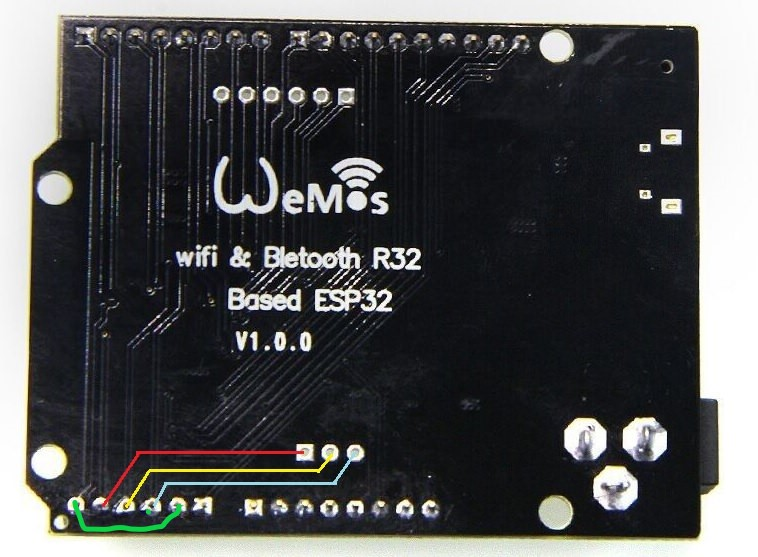
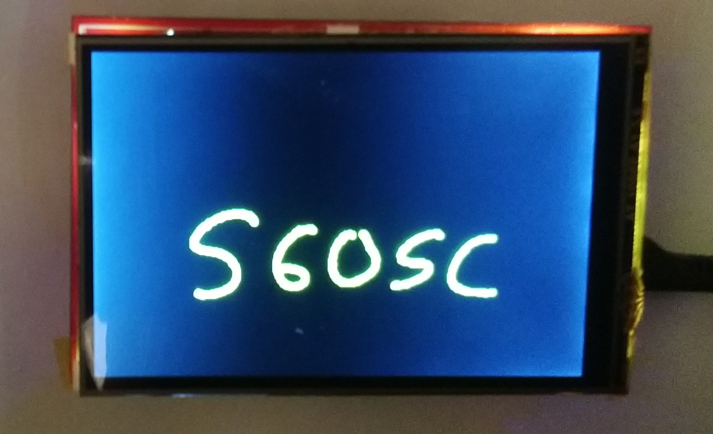

# Adafruit TouchScreen with mod for ESP32 UNO or ESP32S3 UNO

This is the 4-wire resistive touch screen firmware for Arduino modified for ESP32 type UNO boards.
Modification added to allow the 4-wire resistive touchscreen of MCU Friend LCDs with parallel data interfaces to be used with ESP32 UNO style boards whilst WiFi is enabled. Tested on a red board MCU Friend with default touchscreen wiring.

Although not up to data with the lastest Adafruit TouchScreen library it is still valid for ESP32 devices.


## Reason for Modification

ESP32 WiFi removes access to ADC2 channel so pins 4 and 15 attached to the touchscreen no longer have analog input capability. Pin 15 already shares a connection with analog pin 35, so an additional connection is made between pin 4 and analog pin 39. Pins 35 and 39 now provide the analog input. Pins 35 and 39 are input only so always present a high impedance to avoid the risk of two outputs shorting.

## Prerequisites

An extra wiring mod is needed in addition to those shown in the [TFT_eSPI](https://github.com/Bodmer/TFT_eSPI) instructions, but do not affect the software functionality or configuration.

Wiring for ESP UNO type board, with extra wire shown in green:

   
   


## Installing

Download and install the library using your IDE, eg Arduino. 
The modification uses conditional compilation. To enable the changes, modify TouchScreen.h to uncomment #define ESP32_WIFI_TOUCH

```
// ESP32 specific 
#define ESP32_WIFI_TOUCH // uncomment to use parallel MCU Friend LCD touchscreen with ESP32 UNO Wifi
#ifdef CONFIG_IDF_TARGET_ESP32S3  // for ESP32S3 Uno
	#define ADC_MAX 4095  // maximum value for ESP32 ADC (default 11db, 12 bits)
	#define aXM 7	// analog input pin connected to LCD_RS 
	#define aYP 1	// analog input pin connected to LCD_WR	
#elif defined(ESP32)
	#define ADC_MAX 4095  // maximum value for ESP32 ADC (default 11db, 12 bits)
	#define aXM 35  // analog input pin connected to LCD_RS 
	#define aYP 39  // analog input pin connected to LCD_WR
#else
#define ADC_MAX 1023  // Arduino
#endif 
#define NOISE_LEVEL 4  // Allow small amount of measurement noise
```


## Using

No changes are required to existing sketches, just recompilation.

Compatible with both [TFT_eSPI](https://github.com/Bodmer/TFT_eSPI) and [MCUFRIEND_kbv](https://github.com/prenticedavid/MCUFRIEND_kbv/) libraries

Touchscreen needs to be calibrated before use, either manually using included [ESP32testTouch](examples/ESP32testTouch) or eg  [TouchScreen_Calibr_native](https://github.com/prenticedavid/MCUFRIEND_kbv/tree/master/examples/TouchScreen_Calibr_native)

   
